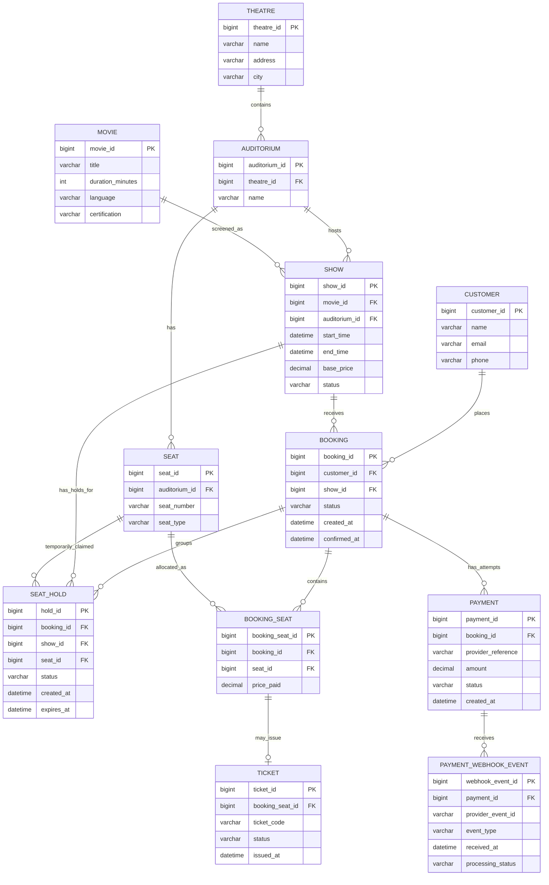

```mermaid
erDiagram
    CUSTOMER {
        bigint customer_id PK
        varchar name
        varchar email
        varchar phone
    }

    THEATRE {
        bigint theatre_id PK
        varchar name
        varchar address
        varchar city
    }

    AUDITORIUM {
        bigint auditorium_id PK
        bigint theatre_id FK
        varchar name
    }

    SEAT {
        bigint seat_id PK
        bigint auditorium_id FK
        varchar seat_number
        varchar seat_type
    }

    MOVIE {
        bigint movie_id PK
        varchar title
        int duration_minutes
        varchar language
        varchar certification
    }

    SHOW {
        bigint show_id PK
        bigint movie_id FK
        bigint auditorium_id FK
        datetime start_time
        datetime end_time
        decimal base_price
        varchar status
    }

    BOOKING {
        bigint booking_id PK
        bigint customer_id FK
        bigint show_id FK
        varchar status
        datetime created_at
        datetime confirmed_at
    }

    SEAT_HOLD {
        bigint hold_id PK
        bigint booking_id FK
        bigint show_id FK
        bigint seat_id FK
        varchar status
        datetime created_at
        datetime expires_at
    }

    BOOKING_SEAT {
        bigint booking_seat_id PK
        bigint booking_id FK
        bigint seat_id FK
        decimal price_paid
    }

    PAYMENT {
        bigint payment_id PK
        bigint booking_id FK
        varchar provider_reference
        decimal amount
        varchar status
        datetime created_at
    }

    PAYMENT_WEBHOOK_EVENT {
        bigint webhook_event_id PK
        bigint payment_id FK
        varchar provider_event_id
        varchar event_type
        datetime received_at
        varchar processing_status
    }

    TICKET {
        bigint ticket_id PK
        bigint booking_seat_id FK
        varchar ticket_code
        varchar status
        datetime issued_at
    }

    THEATRE ||--o{ AUDITORIUM : contains
    AUDITORIUM ||--o{ SEAT : has
    AUDITORIUM ||--o{ SHOW : hosts
    MOVIE ||--o{ SHOW : screened_as

    CUSTOMER ||--o{ BOOKING : places
    SHOW ||--o{ BOOKING : receives

    BOOKING ||--o{ SEAT_HOLD : groups
    SHOW ||--o{ SEAT_HOLD : has_holds_for
    SEAT ||--o{ SEAT_HOLD : temporarily_claimed

    BOOKING ||--o{ BOOKING_SEAT : contains
    SEAT ||--o{ BOOKING_SEAT : allocated_as

    BOOKING ||--o{ PAYMENT : has_attempts
    PAYMENT ||--o{ PAYMENT_WEBHOOK_EVENT : receives

    BOOKING_SEAT ||--o| TICKET : may_issue
```